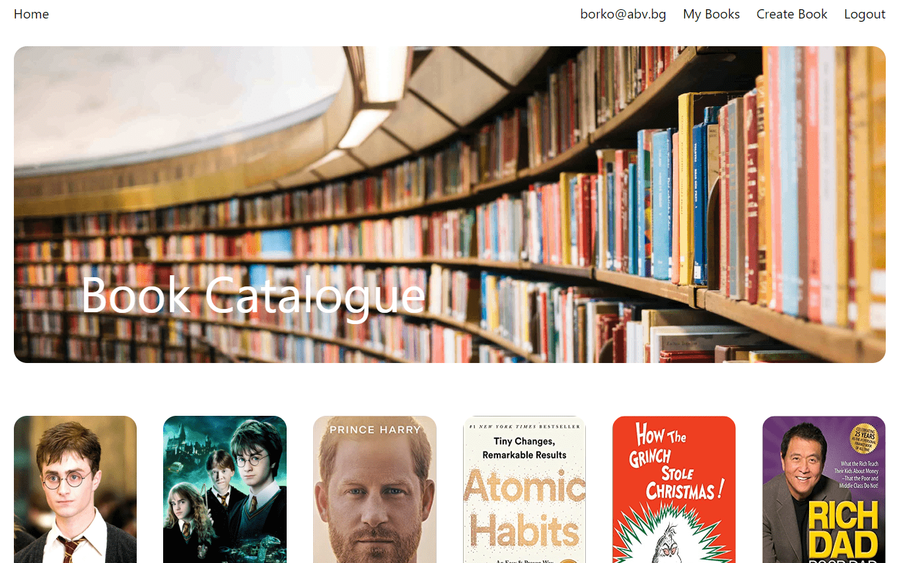
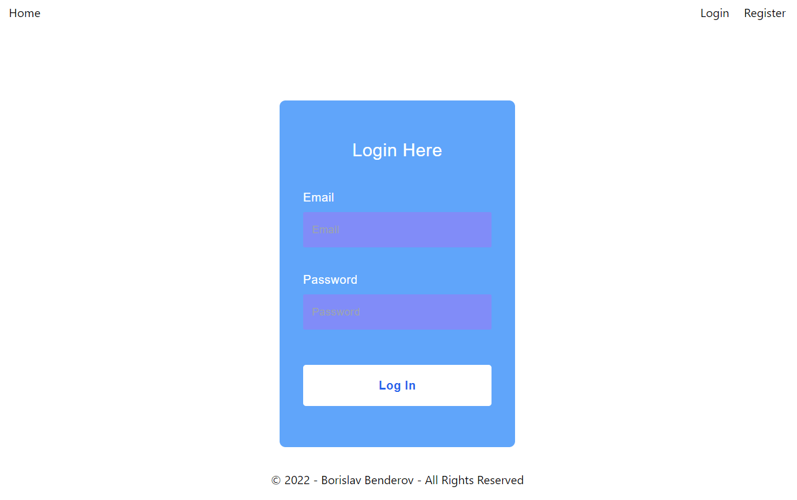
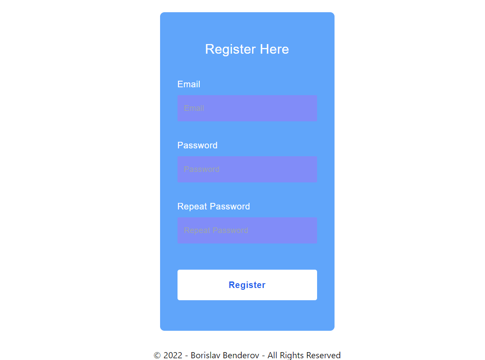
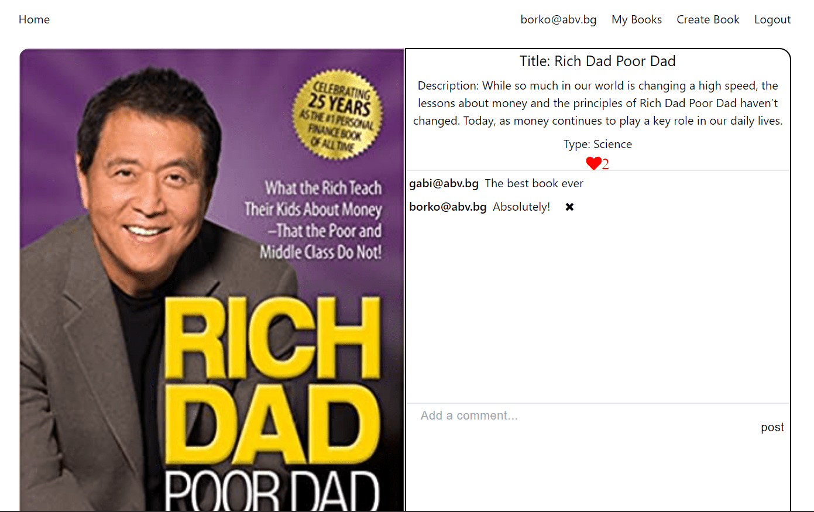
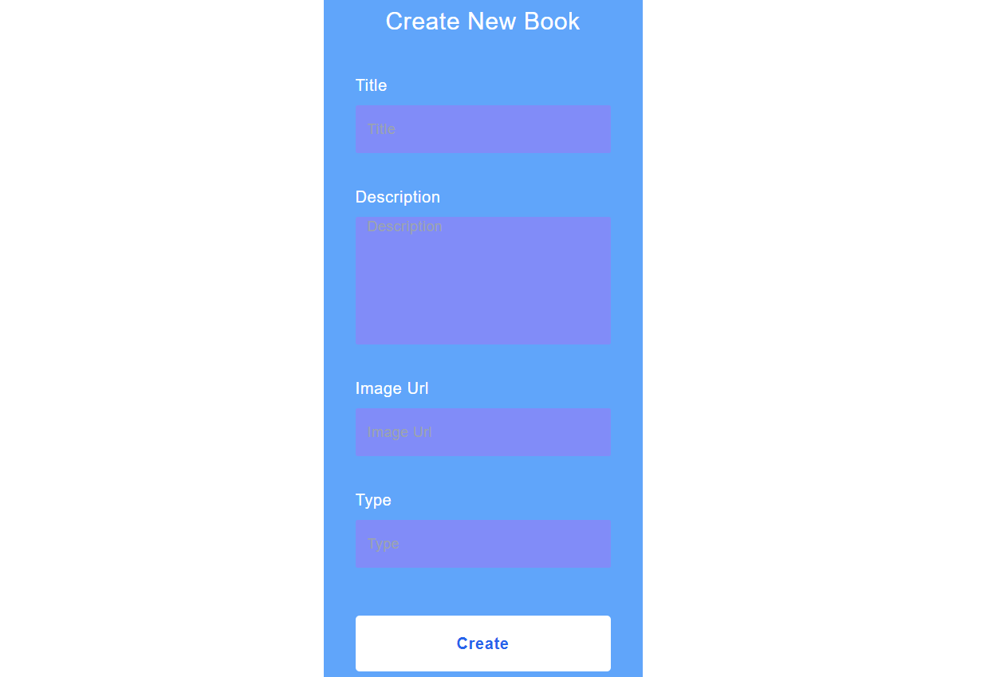
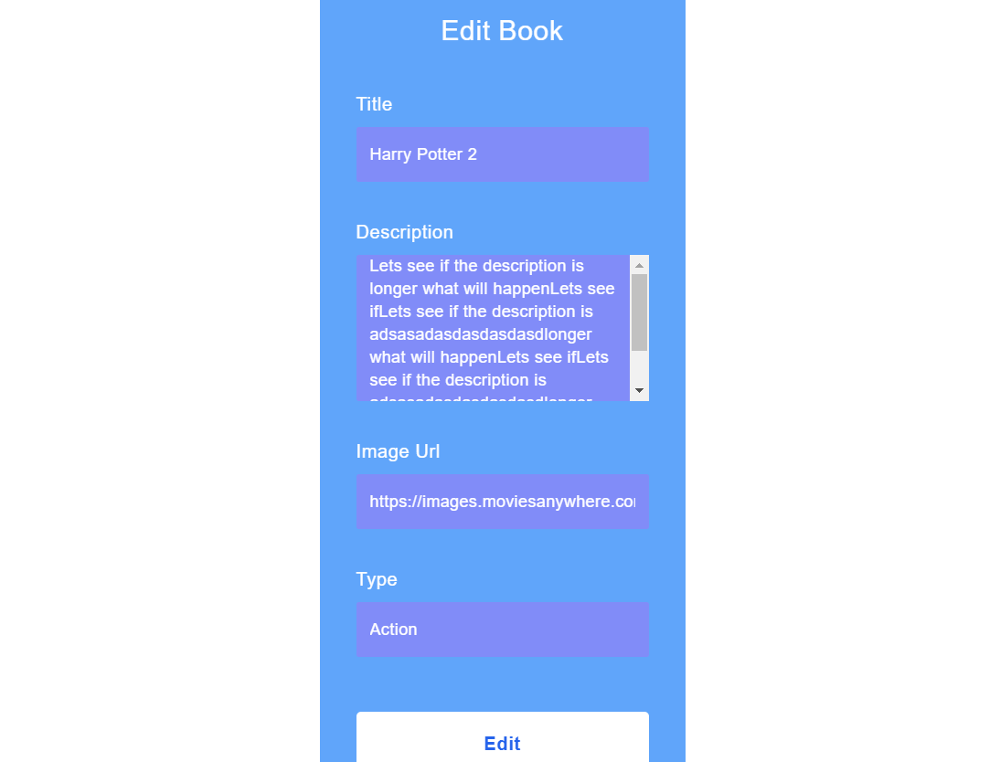

# Book Catalogue Application created with MERN stack

## Project Description

This is Book Catalogue Application created with Node JS, Express, Mongo DB, React JS and TailwindCSS. Users have
possibility to register and login. They can interact with each other with posts and comments. They can create, edit, like and delete posts. Users have possibility to make comments on different posts and delete their comments. Users have page with their created books.

## Services

### Login

This service is initialized with two users, which can be used for immediate testing:

- borko@abv.bg: 123456
- gabi@abv.bg: 123456

### Register

Create a new user by entered email, password and confirmation password.

### Home

After login or register user will be redirect to a home page. On this page user can see all posts in the 
application.

### Book Details

When user click on a given post in home page he can see all details of this post. On this page user can like post, make a comments and delete a comments.

### Create Post

When user click on a create book button he will see create new book page. On this page user can create a post with title,description, image url and type.

### Edit Post

When user click on edit button on some of his books in book details page, user can possibility to edit current post title, description, image url and type.

### Delete Post

When user click on delete button on some of his books in book details page, user will be asked to delete this post. If he confirm post will be deleted.

### Logout

When user click on the sixth icon in navigation panel his session has expired.

### Guest Users

Guest users can see dashboard, book details, login and register pages.

### Live Demo

https://mern-book-app-uq21.onrender.com
